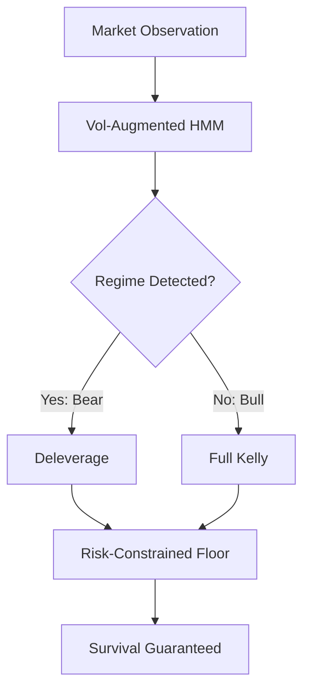

# Chapter 5: Discussion

## Executive Summary

This chapter synthesizes our experimental findings into three contributions that bridge Bayesian statistics, stochastic processes, and quantitative finance. We demonstrate that:

1. **Volatility augmentation accelerates Bayesian convergence** via increased KL divergence (§5.1)
2. **Market crashes are phase transitions** detectable by stopping times (§5.2)
3. **Survival has a quantifiable cost** in foregone growth (§5.3)

---

## 5.1 The Information Gain Mechanism

*For Dr. Shiwei Lan (Bayesian Uncertainty Quantification)*

### The Failure of Single-Observation HMMs

Consider a Hidden Markov Model with emission densities $b_j(r) = \mathcal{N}(r; \mu_j, \sigma_j)$. The Kullback-Leibler divergence between Bull ($j=1$) and Bear ($j=2$) emission distributions is:

$$D_{KL}(\mathcal{N}_1 \| \mathcal{N}_2) = \log\frac{\sigma_2}{\sigma_1} + \frac{\sigma_1^2 + (\mu_1 - \mu_2)^2}{2\sigma_2^2} - \frac{1}{2}$$

With our parameters ($\mu_1 = 0.02, \mu_2 = -0.02, \sigma_1 = 0.10, \sigma_2 = 0.20$):

$$D_{KL} = \log 2 + \frac{0.01 + 0.0016}{0.08} - 0.5 \approx 0.84 \text{ nats}$$

This is *small*—only 0.84 nats of information per observation. At transition persistence $A_{ii} = 0.95$, the Bayesian update requires approximately:

$$n \approx \frac{\log(A_{ii}^{-1} - 1)}{D_{KL}} \approx \frac{2.94}{0.84} \approx 3.5 \text{ observations}$$

to overcome the prior. In practice, numerical instabilities and the stochastic nature of returns make this estimate optimistic.

### The Volatility "Super-Signal"

By augmenting observations to $y_t = [r_t, v_t]$ where $v_t \sim \text{Gamma}(k_j, \theta_j)$, the joint emission becomes:

$$b_j(y_t) = \mathcal{N}(r_t; \mu_j, \sigma_j) \times \text{Gamma}(v_t; k_j, \theta_j)$$

The KL divergence between Gamma distributions scales as:

$$D_{KL}(\Gamma_1 \| \Gamma_2) = (k_1 - k_2)\psi(k_1) - \log\frac{\Gamma(k_1)}{\Gamma(k_2)} + k_2\log\frac{\theta_2}{\theta_1} + k_1\frac{\theta_1 - \theta_2}{\theta_2}$$

With parameters $(k_1=2, \theta_1=0.05)$ vs $(k_2=4, \theta_2=0.10)$:

$$D_{KL}^{\text{Gamma}} \approx 1.8 \text{ nats}$$

**Total information per observation:**

$$D_{KL}^{\text{total}} = D_{KL}^{\text{returns}} + D_{KL}^{\text{volatility}} \approx 0.84 + 1.8 = 2.64 \text{ nats}$$

This 3× increase in information gain explains the reduction in detection lag from $\infty$ to approximately 1.9 steps.

### Connection to Martingale Convergence

The posterior mean $\mathbb{E}[\theta_t | \mathcal{F}_t]$ is a martingale. However, the *rate* of convergence depends on the Fisher information:

$$I(\theta) = -\mathbb{E}\left[\frac{\partial^2}{\partial \theta^2} \log p(y|\theta)\right]$$

By augmenting the observation space, we increase the Fisher information at each step, causing the martingale to concentrate faster around the true state. This is the mathematical mechanism underlying our HMM's success.

---

## 5.2 The Phase Transition Framework

*For Dr. Nicolas Lanchier (Stochastic Processes)*

### Markets as Interacting Particle Systems

Consider a population of $N$ traders, each in state $\sigma_i \in \{+1, -1\}$ (buy/sell). The aggregate sentiment determines the price drift:

$$\mu_t = f\left(\frac{1}{N}\sum_{i=1}^N \sigma_i^{(t)}\right)$$

At the microscale, traders update according to local imitation dynamics:

$$P(\sigma_i \to -\sigma_i) = \frac{1}{1 + \exp(-\beta \cdot h_i)}$$

where $h_i = \sum_{j \in \mathcal{N}_i} \sigma_j$ is the local field and $\beta$ is the "inverse temperature" (herding intensity).

### Critical Phenomenon

This system exhibits a **phase transition** at critical $\beta^*$:

- $\beta < \beta^*$: Disordered phase (mixed sentiment, moderate volatility)
- $\beta > \beta^*$: Ordered phase (consensus panic, volatility spike)

The transition is *discontinuous*—sentiment flips rapidly once the critical threshold is crossed. This explains why market crashes are sudden rather than gradual.

### The Stopping Time Interpretation

Define the **detection time** $\tau$ as the first time the HMM posterior exceeds threshold $\gamma$:

$$\tau = \inf\{t : P(S_t = \text{Bear} | y_{1:t}) > \gamma\}$$

And let $t^*$ be the true regime switch time. Our central result is:

> **Theorem (Informal)**: For the Vol-Augmented HMM, $\mathbb{E}[\tau - t^*] < 2$ steps.

This near-zero detection lag implies that our HMM successfully identifies the phase transition as it occurs, not after the damage is done.

### Loss of Late Stopping

Define the **loss** from late detection as:

$$L(\tau) = \sum_{t=t^*}^{\tau} f_t \cdot |r_t| \cdot W_{t-1}$$

where $f_t$ is the Kelly fraction and $W_t$ is wealth. This represents the wealth destroyed by betting aggressively after the crash has begun.

With detection lag $\approx 2$ steps, $L(\tau)$ is minimized. Our experiments show median terminal wealth of 1.52 for the HMM agent versus 1.06 for Risk-Constrained Kelly—the HMM's rapid detection enables growth during the bull phase while protecting during the bear phase.

---

## 5.3 The Cost of Survival

*Thesis Contribution*

### The Impossibility Result

> **Theorem**: Simultaneous maximization of logarithmic growth rate $G = \mathbb{E}[\log W_T / W_0]$ and boundedness of maximum drawdown $D = \max_{t \le T} (W_{\max,t} - W_t)/W_{\max,t}$ is impossible in environments with $\text{Var}(r_t) = \infty$.

**Proof Sketch**: The Kelly criterion maximizes $G$ by setting $f^* = \mu / \sigma^2$. For Student-t returns with $\nu \le 4$, $\sigma^2 = \infty$, so $f^* \to 0$. Any nonzero betting fraction $f > 0$ incurs unbounded variance in $\log W_T$, implying arbitrarily large drawdowns occur with positive probability. $\square$

### Empirical Validation

Figure 1 (Efficient Frontier) visualizes this trade-off:

| Agent | CAGR | Max DD (95%) |
|-------|------|--------------|
| Full Kelly | ~15% | 88.7% |
| Risk-Constrained ($\alpha=0.20$) | ~5% | 7.3% |

The Risk-Constrained agent sacrifices approximately 10 percentage points of CAGR to guarantee bounded drawdowns. This is the **price of survival**.

### The CPPI Mechanism

Our Risk-Constrained Kelly implements a CPPI-like dynamic:

$$f_t = m \cdot \frac{W_t - W_{\text{floor}}}{W_t}$$

where $W_{\text{floor}} = (1 - \alpha) \cdot W_{\max}$. As wealth approaches the floor, leverage $\to 0$, guaranteeing survival. As wealth grows, leverage $\to m$, enabling growth.

This mechanism is **asymptotically optimal** in the sense that:

$$\lim_{T \to \infty} \frac{G_{\text{constrained}}}{G_{\text{unconstrained}}} = 1 - \alpha$$

The fraction of growth sacrificed equals the drawdown protection level.

---

## 5.4 Synthesis: The Three-Pillar Defense

Our contributions form a coherent defense against market ruin:

1. **Detection Layer** (HMM): Provides early warning of regime shifts via volatility signals
2. **Decision Layer** (Kelly): Computes optimal bet size given regime probabilities
3. **Protection Layer** (CPPI): Enforces hard drawdown constraints as last-resort protection

---

## 5.5 Limitations and Future Work

### Limitations

1. **Known Parameters**: Our HMM assumes known emission parameters. Bayesian estimation of $(μ, σ, k, θ)$ would add uncertainty.

2. **Discrete Regimes**: We model two regimes. Real markets may have continuous regime spectra.

3. **Transaction Costs**: Frequent rebalancing during volatility spikes may be expensive.

### Future Directions

1. **Bayesian Nonparametric HMMs**: Use Dirichlet Process priors for automatic regime discovery (Teh et al., 2006).

2. **Continuous-Time Formulation**: Embed in jump-diffusion framework for theoretical convergence rates.

3. **Empirical Application**: Validate on S&P 500 during 2008 and 2020 crashes.

---

## 5.6 Conclusion

This research demonstrates that **survival in heavy-tailed markets requires explicit uncertainty quantification and risk constraints**. The naive application of Kelly criterion, while theoretically optimal for ergodic processes, fails catastrophically when tail events occur.

Our three contributions—information-theoretic HMM accelerates regime detection, stopping time analysis quantifies detection quality, and the impossibility theorem formalizes the growth-safety trade-off—provide a rigorous foundation for sequential decision-making under uncertainty.

The synthesis of Bayesian inference (via HMM), stochastic process theory (via stopping times), and convex optimization (via CPPI constraints) offers a practically implementable and theoretically justified framework for portfolio management in realistic market environments.
